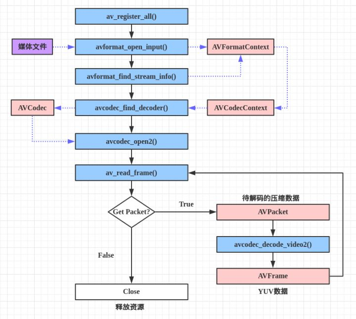

> 基于 FFmpeg 和 SDL 实现简易视频播放器，主要分为读取视频文件解码和调用 SDL 播放两大部分。首先尝试实现**视频播放**（无声音）。


- 解协议：将流媒体协议的数据，解析为标准的相应的封装格式数据。例如，采用 RTMP 协议传输的数据，经过解协议操作后，输出 FLV 格式的数据；
- 解封装：将输入的封装格式的数据，分离成为**音频**流压缩编码数据和**视频**流压缩编码数据。例如，FLV 格式的数据，经过解封装操作后，输出 H.264 编码的视频码流和 AAC 编码的音频码流。
- 解码：将视频/音频压缩编码数据，解码成为非压缩的视频/音频原始数据。音频的压缩编码标准包含 AAC，MP3，AC-3 等等，视频的压缩编码标准则包含 H.264，MPEG2，VC-1 等等。解码是整个系统中最重要也是最复杂的一个环节。通过解码，压缩编码的视频数据输出成为非压缩的颜色数据，例如 YUV420P，RGB 等等；压缩编码的音频数据输出成为非压缩的音频抽样数据，例如 PCM 数据。
- 音视频同步：根据解封装模块处理过程中获取到的参数信息，同步解码出来的视频和音频数据，并将视频音频数据送至系统的显卡和声卡播放出来。

使用FFmpeg库实现视频播放的函数调用流程图：



- 初始化

  ```c
  // 初始化libavformat(所有格式)，注册所有复用器/解复用器
  // av_register_all();   // 已被申明为过时的，直接不再使用即可
  ```

- 打开视频文件

  读取文件头，将文件格式信息存储在"fmt context"中。

  ```c
  ret = avformat_open_input(&p_fmt_ctx, argv[1], NULL, NULL);
  ```

- 搜索流信息

  读取一段视频文件数据，尝试解码，将取到的流信息填入pFormatCtx->streams。p_fmt_ctx->streams是一个指针数组，数组大小是pFormatCtx->nb_streams。

  ```c
  ret = avformat_find_stream_info(p_fmt_ctx, NULL);
  ```

- 查找第一个视频流

  ```c
  v_idx = -1;
  for (i = 0; i < p_fmt_ctx->nb_streams; i++)
  {
    if (p_fmt_ctx->streams[i]->codecpar->codec_type == AVMEDIA_TYPE_VIDEO)
    {
      v_idx = i;
      printf("Find a video stream, index %d\n", v_idx);
      frame_rate = p_fmt_ctx->streams[i]->avg_frame_rate.num /
        p_fmt_ctx->streams[i]->avg_frame_rate.den;
      break;
    }
  }
  ```

- 为视频流构建解码器AVCodecContext

  - 获取解码器参数AVCodecParameters

    ```c
    p_codec_par = p_fmt_ctx->streams[v_idx]->codecpar;
    ```

  - 获取解码器

    ```c
    p_codec = avcodec_find_decoder(p_codec_par->codec_id);
    ```

  - 构建解码器AVCodecContext

    ```c
    // p_codec_ctx初始化：分配结构体，使用p_codec初始化相应成员为默认值
    p_codec_ctx = avcodec_alloc_context3(p_codec);
    if (p_codec_ctx == NULL)
    {
      printf("avcodec_alloc_context3() failed %d\n", ret);
      res = -1;
    }
    // p_codec_ctx初始化：p_codec_par ==> p_codec_ctx，初始化相应成员
    ret = avcodec_parameters_to_context(p_codec_ctx, p_codec_par);
    if (ret < 0)
    {
      printf("avcodec_parameters_to_context() failed %d\n", ret);
      res = -1;
    }
    // p_codec_ctx初始化：使用p_codec初始化p_codec_ctx，初始化完成
    ret = avcodec_open2(p_codec_ctx, p_codec, NULL);
    if (ret < 0)
    {
      printf("avcodec_open2() failed %d\n", ret);
      res = -1;
    }
    ```

- 分配AVFrame

  AVFrame.*data[]是手工分配的缓冲区，用于存储sws_scale()中目的帧视频数据。p_frm_raw的data_buffer由av_read_frame()分配，因此不需手工分配；p_frm_yuv的data_buffer无处分配，因此在此处手工分配。buffer将作为p_frm_yuv的视频数据缓冲区。

- 初始化SWS context，用于后续图像转换。

  FFmpeg中的像素格式AV_PIX_FMT_YUV420P对应SDL中的像素格式SDL_PIXELFORMAT_IYUV。如果解码后得到图像的不被SDL支持，不进行图像转换的话，SDL是无法正常显示图像的。如果解码后得到图像的能被SDL支持，则不必进行图像转换。这里为了编码简便，统一转换为SDL支持的格式：AV_PIX_FMT_YUV420P==>SDL_PIXELFORMAT_IYUV。

  ```c
  sws_ctx = sws_getContext(
    p_codec_ctx->width,   // src width
    p_codec_ctx->height,  // src height
    p_codec_ctx->pix_fmt, // src format
    p_codec_ctx->width,   // dst width
    p_codec_ctx->height,  // dst height
    AV_PIX_FMT_YUV420P,   // dst format
    SWS_BICUBIC,          // flags
    NULL,                 // src filter
    NULL,                 // dst filter
    NULL                  // param
  );
  ```

- SDL相关调用

  ```c
  // 初始化SDL子系统：缺省(事件处理、文件IO、线程)、视频、音频、定时器
  if (SDL_Init(SDL_INIT_VIDEO | SDL_INIT_TIMER))
  {
    printf("SDL_Init() failed: %s\n", SDL_GetError());
    res = -1;
    goto exit6;
  }
  
  // 创建SDL窗口，SDL 2.0支持多窗口
  // SDL_Window即运行程序后弹出的视频窗口，同SDL 1.x中的SDL_Surface
  screen = SDL_CreateWindow("simple ffplayer",
                            SDL_WINDOWPOS_UNDEFINED, // 不关心窗口X坐标
                            SDL_WINDOWPOS_UNDEFINED, // 不关心窗口Y坐标
                            p_codec_ctx->width,
                            p_codec_ctx->height,
                            SDL_WINDOW_OPENGL);
  // 创建SDL_Renderer
  // SDL_Renderer：渲染器
  sdl_renderer = SDL_CreateRenderer(screen, -1, 0);
  
  
  // 创建SDL_Texture
  // 一个SDL_Texture对应一帧YUV数据，同SDL 1.x中的SDL_Overlay
  // 此处第2个参数使用的是SDL中的像素格式，对比参考注释A7
  // FFmpeg中的像素格式AV_PIX_FMT_YUV420P对应SDL中的像素格式SDL_PIXELFORMAT_IYUV
  sdl_texture = SDL_CreateTexture(sdl_renderer,
                                  SDL_PIXELFORMAT_IYUV,
                                  SDL_TEXTUREACCESS_STREAMING,
                                  p_codec_ctx->width,
                                  p_codec_ctx->height);
  sdl_rect.x = 0;
  sdl_rect.y = 0;
  sdl_rect.w = p_codec_ctx->width;
  sdl_rect.h = p_codec_ctx->height;
  ```

- 创建线程，用于定时刷新事件线程

  创建定时刷新事件线程，按照预设帧率产生刷新事件。

  ```c
  sdl_thread = SDL_CreateThread(sdl_thread_handle_refreshing, NULL, (void *)&frame_rate);
  
  // 按照opaque传入的播放帧率参数，按固定间隔时间发送刷新事件
  int sdl_thread_handle_refreshing(void *opaque)
  {
      SDL_Event sdl_event;
  
      int frame_rate = *((int *)opaque);
      int interval = (frame_rate > 0) ? 1000 / frame_rate : 40;
  
      printf("frame rate %d FPS, refresh interval %d ms\n", frame_rate, interval);
  
      while (!s_playing_exit)
      {
          if (!s_playing_pause)
          {
              sdl_event.type = SDL_USEREVENT_REFRESH;
              SDL_PushEvent(&sdl_event);
          }
          SDL_Delay(interval);
      }
  
      return 0;
  }
  ```

- 从视频流读取数据包            

  从视频文件中读取一个packet，packet可能是视频帧、音频帧或其他数据，解码器只会解码视频帧或音频帧，非音视频数据并不会被扔掉、从而能向解码器提供尽可能多的信息。

  对于视频来说，一个packet只包含一个frame；对于音频来说，若是帧长固定的格式则一个packet可包含整数个frame；若是帧长可变的格式则一个packet只包含一个frame。

  ```c
  while (av_read_frame(p_fmt_ctx, p_packet) == 0)
  {
  	  if (p_packet->stream_index == v_idx) // 取到一帧视频帧，则退出
  	  {
   		 		break;
   	  }
  }
  ```

  - 视频解码：packet ==> frame

    ```c
    // 向解码器喂数据，一个packet可能是一个视频帧或多个音频帧，此处音频帧已被上一句滤掉
    ret = avcodec_send_packet(p_codec_ctx, p_packet);
    // 接收解码器输出的数据，此处只处理视频帧，每次接收一个packet，将之解码得到一个frame
    ret = avcodec_receive_frame(p_codec_ctx, p_frm_raw);
    ```

  - 图像转换：p_frm_raw->data ==> p_frm_yuv->data

    将源图像中一片连续的区域经过处理后更新到目标图像对应区域，处理的图像区域必须逐行连续。
  
    - plane：如YUV有Y、U、V三个plane，RGB有R、G、B三个plane；
    - slice：图像中一片连续的行，必须是连续的，顺序由顶部到底部或由底部到顶部；
    - stride/pitch：一行图像所占的字节数，Stride = BytesPerPixel * Width + Padding，注意对齐；
    - AVFrame.*data[]：每个数组元素指向对应plane；
    - AVFrame.linesize[]：每个数组元素表示对应plane中一行图像所占的字节数 ；
  
    ```c
    sws_scale(sws_ctx,                                 // sws context
              (const uint8_t *const *)p_frm_raw->data, // src slice
              p_frm_raw->linesize,                     // src stride
              0,                                       // src slice y
              p_codec_ctx->height,                     // src slice height
              p_frm_yuv->data,                         // dst planes
              p_frm_yuv->linesize                      // dst strides
             );
    ```
  
  - 视频渲染
  
    ```c
    // 使用新的YUV像素数据更新SDL_Rect
        SDL_UpdateYUVTexture(sdl_texture,            // sdl texture
                              &sdl_rect,              // sdl rect
                              p_frm_yuv->data[0],     // y plane
                              p_frm_yuv->linesize[0], // y pitch
                              p_frm_yuv->data[1],     // u plane
                              p_frm_yuv->linesize[1], // u pitch
                              p_frm_yuv->data[2],     // v plane
                              p_frm_yuv->linesize[2]  // v pitch
    );
    // 使用特定颜色清空当前渲染目标
    SDL_RenderClear(sdl_renderer);
    // 使用部分图像数据(texture)更新当前渲染目标
    SDL_RenderCopy(sdl_renderer, // sdl renderer
                  sdl_texture,  // sdl texture
                  NULL,         // src rect, if NULL copy texture
                  &sdl_rect     // dst rect
    );
    // 执行渲染，更新屏幕显示
    SDL_RenderPresent(sdl_renderer);
    ```

# 参考

- [FFmpeg简易播放器的实现2-视频播放 - 叶余 - 博客园 (cnblogs.com)](https://www.cnblogs.com/leisure_chn/p/10047035.html)
- [最简单的基于FFMPEG+SDL的视频播放器 ver2 （采用SDL2.0）_雷霄骅的博客-CSDN博客_ffmpeg sdl](https://blog.csdn.net/leixiaohua1020/article/details/38868499)
- [[总结\]视音频编解码技术零基础学习方法_雷霄骅的博客-CSDN博客_音视频编解码入门](https://blog.csdn.net/leixiaohua1020/article/details/18893769)

